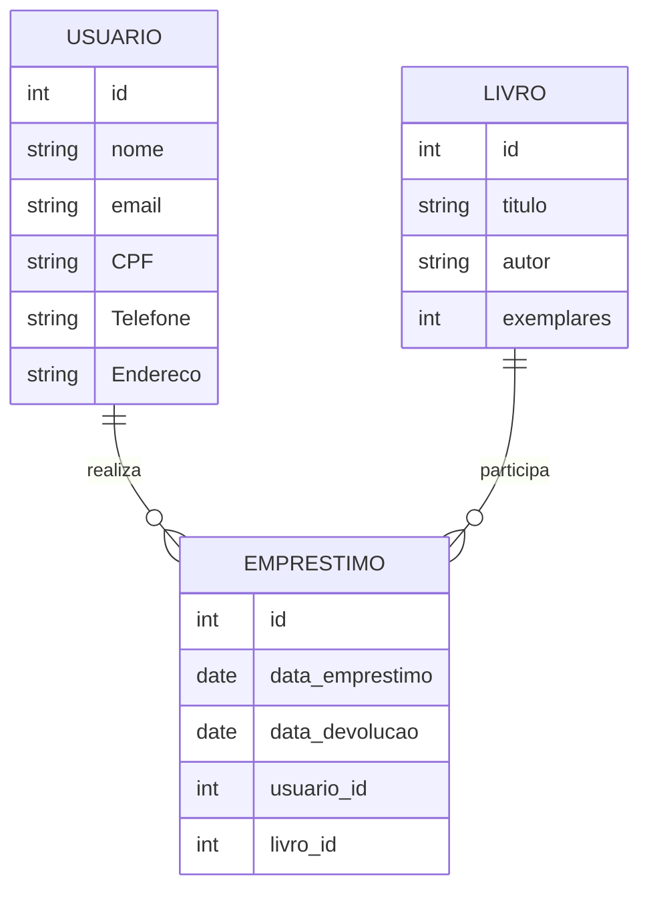

# Projeto backend de uma Livraria

Projeto para estudo dos príncipios da Clean Architecture

## Diagrama de Classe

```mermaid
erDiagram
    USUARIO ||--o{ EMPRESTIMO : realiza
    LIVRO ||--o{ EMPRESTIMO : participa

    USUARIO {
        int id
        string nome
        string email
        string CPF
        string Telefone
        string Endereco
    }

    LIVRO {
        int id
        string titulo
        string autor
        int exemplares
    }

    EMPRESTIMO {
        int id
        date data_emprestimo
        date data_devolucao
        int usuario_id
        int livro_id
    }
```
