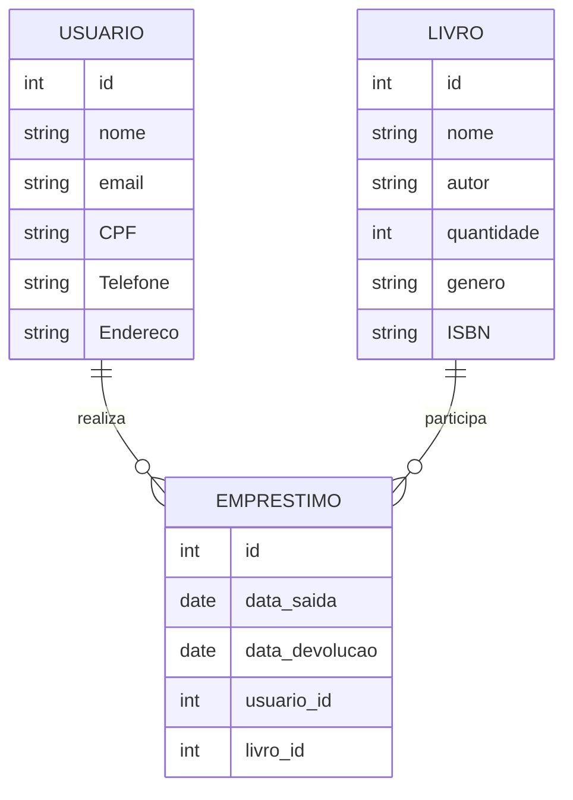

# 📚 Sistema de Empréstimo de Livros – Backend

Sistema desenvolvido para gerenciar a entrada e saída de livros em uma biblioteca, utilizando os princípios da **Clean Architecture**, testes automatizados e envio de notificações por e-mail.

## ✨ Funcionalidades

- Cadastro de usuários com validações únicas (CPF e e-mail)
- Cadastro de livros com verificação de ISBN único
- Empréstimo de livros com regras de negócio específicas
- Devolução de livros com verificação de multa por atraso
- Listagem de empréstimos pendentes
- Envio automático de e-mail no momento do empréstimo
- Validações de domínio com Zod
- Arquitetura desacoplada, focada em testabilidade e manutenibilidade

---

## 🎯 Requisitos da Biblioteca

> "Somos uma biblioteca pequena e gostaríamos de controlar nossa entrada e saída de livros. Precisamos cadastrar usuários, livros, emprestar livros e visualizar os empréstimos pendentes."

---

## 🧠 Regras de Negócio

### Usuário

- [x] CPF e e-mail devem ser únicos
- [x] Buscar usuário por CPF

### Livro

- [x] ISBN deve ser único
- [x] Buscar livro por nome ou ISBN
- [x] Quantidade deve ser ≥ 0
- [x] Editar dados do livro

### Empréstimo

- [x] Data de retorno ≥ data de saída
- [x] Um usuário não pode emprestar 2 livros com o mesmo ISBN simultaneamente
- [x] Pode emprestar livros com ISBNs diferentes simultaneamente
- [x] Enviar e-mail com dados do empréstimo
- [x] Geração de multa de R$10 em caso de atraso na devolução
- [x] Impedir devolução duplicada
- [x] Validar data de devolução ≥ data de saída
- [x] Listar empréstimos pendentes, ordenados por data de retorno

---

## 🧩 Diagrama de Classe



## 🏛️ Arquitetura

O projeto segue os princípios da **Clean Architecture**:

- `domain/` → Entidades e casos de uso
- `application/` → Interfaces de serviços e gateways
- `infra/` → Repositórios (SQLite/PostgreSQL via TypeORM), serviços de email e agendadores
- `main/` → Rotas Express, configurações e orquestração da aplicação

---

## 🛠️ Tecnologias Utilizadas

- **Node.js**, **Express**
- **TypeORM** (SQLite/PostgreSQL)
- **Zod** (validações)
- **Nodemailer** (e-mails)
- **Postgres** (banco de dados)
- **Bull** + **Bull Board** + **Redis** (filas de envio)
- **Jest** + **Supertest** (testes unitários e de integração)
- **dotenv**, **cross-env**

---

## 🧪 Testes

Rodar todos os testes:

```bash
npm run test:all
```

Rodar testes separados:

```bash
npm test
npm run test:integration
```

## 🚀 Como rodar o projeto localmente

I. Subir o container com a imagem do banco (Postgres) e Redis (necessário para a lib bull)

II. Instalar dependencias e subir o servidor da aplicação:

```bash
npm install
npm run dev
```

III. Em outro terminal rodar servidor redis:

```bash
node ./src/main/api/queue
```

---

## 📖 Créditos

Este projeto foi inspirado e baseado no curso:

- [Criando APIs testáveis com Clean Architecture, JS e Node.js](https://github.com/vspinellis/clean-js)
